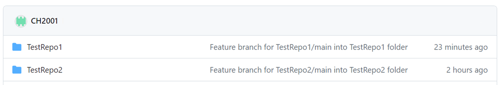

# RepoMerger

## About 
RepoMerger allows users to organize their git repositories into a single repository. It is a shell script that improves the efficieny in merging git repositories and allows multiple git repository link input. 

## How to use? 
### repomerger_function.sh
1. Grant executable permissions to `chmod +x repomerger_function.sh`. 
2. Use source function `source repomerger_function`
3. Utilize the function `merge_repositories <repo-link-1> <repo-link-2>`.


### repomerger.sh
1. Grant executable permissions to `chmod +x repomerger.sh`. 
2. Create a text file, repositories.txt via `mkdir repositories.txt`. Make sure it is in the same directory as `repomerger.sh` script. Include all repository links one line per each. 
3. Run the script `./repomerger.sh`.


## Example 
Code: 
```
merge_repositories https://github.com/CH2001/TestRepo1.git https://github.com/CH2001/TestRepo2.git
```
Output: 
